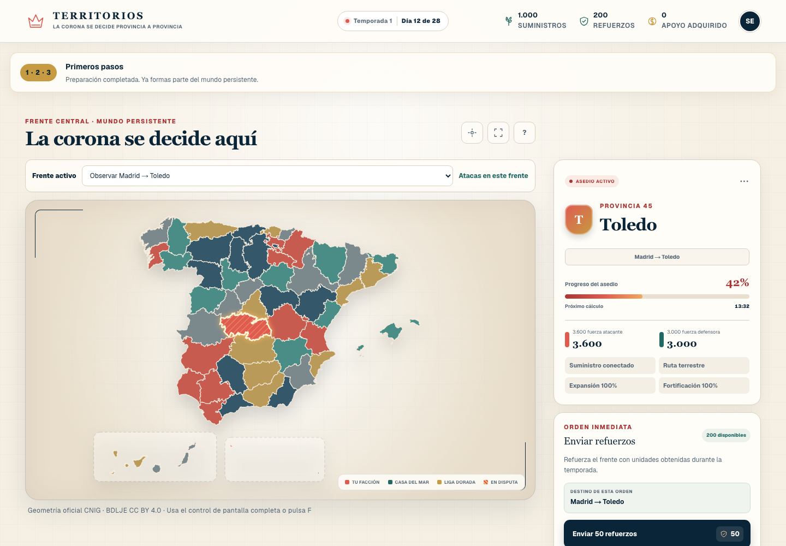
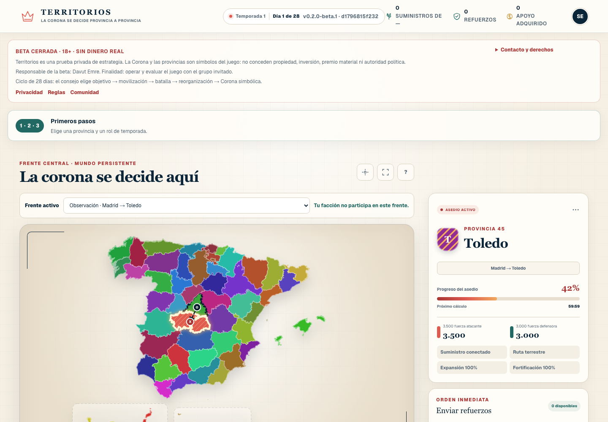
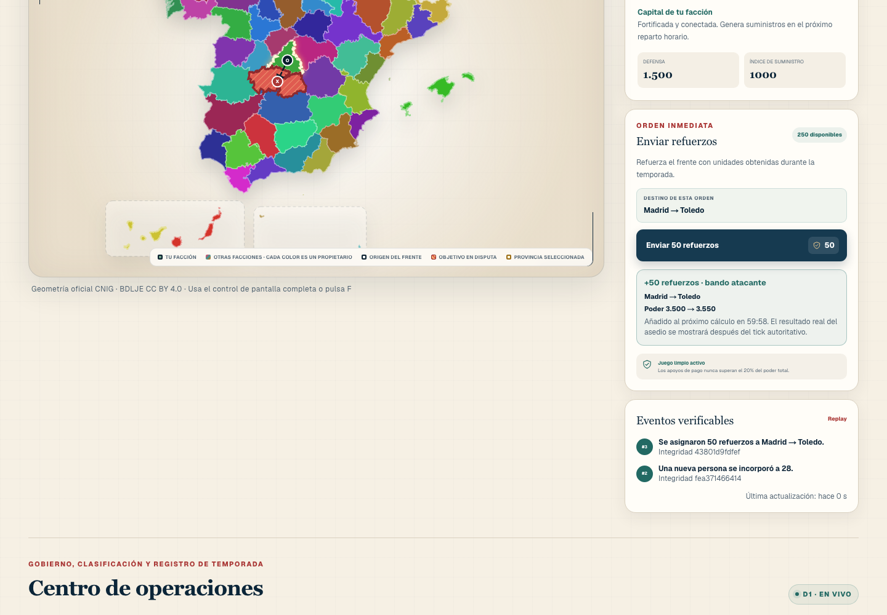
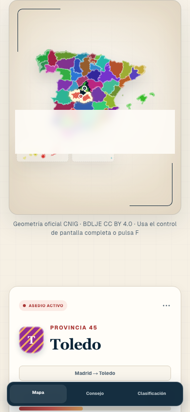

# Territorios

Territorios is a mobile-first, seasonal browser strategy game set across the 52 provinces and autonomous cities of Spain. The game is server-authoritative, deterministic, bilingual (Spanish/English), and built for ChatGPT Sites with platform Auth and D1.

This repository contains the `v0.2.0-beta.1` no-real-money closed-beta candidate:

- official CNIG-derived province geometry with recorded provenance;
- a fresh day-one world with 52 independently identified factions and eight deterministic opening fronts;
- council-selected campaign cycles, mobilization, hourly combat ticks, cooldown, replay hashes, Crown selection, season closure/reset, and leaderboards;
- guided focus provinces, seven daily roles, five-seat councils, announcements, fixed-vocabulary reports, privacy requests, and bounded notifications;
- visible `+50` first-action feedback with side, route, before/after power, fair-play boundary, and the next authoritative tick;
- color-independent ownership, selected province, attack origin, contested target, and viewer-faction map states;
- versioned 18+ consent, participant receipts, no-PII aggregate metrics, and an explicit no-property/no-political-authority notice;
- a hard release switch that hides the store and returns `404` from every payment route, even if payment credentials are accidentally present;
- WCAG 2.2 AA automated checks and a 390 px mobile reflow gate.

The candidate is owner-only until its real 8–15-adult human gate is run. It accepts no real-money payment and must not be described as property, investment, gambling, a prize, or political authority.

## Screenshots

### Before: repeated ownership colors and the older command surface



### After: truthful day-one ownership and guided onboarding



### After: authoritative first free order



### After: mobile map and command surface



The complete visual evidence set, including attacker/defender, council, replay, privacy, map help, 200% zoom, and grayscale states, is indexed in [`docs/screenshots/release-screenshot-manifest.json`](docs/screenshots/release-screenshot-manifest.json).

## Run a live local world

Requirements: Node.js `>=22.13` and npm. The full verification suite also needs `sqlite3`.

```bash
git clone https://github.com/detasar/territorios.git
cd territorios
npm ci
npm run dev
```

Open `http://localhost:3000/signin-with-chatgpt?return_to=%2F` to enter through the local ChatGPT Auth simulator. `npm run dev` automatically applies pending migrations to a local D1 database before starting the game, so a fresh clone does not need a separate database command. Generated state persists under the ignored `.wrangler/` directory and the command never migrates the remote D1 database.

Use another port when needed:

```bash
npm run dev -- --port 3020
```

The corresponding sign-in URL is then `http://localhost:3020/signin-with-chatgpt?return_to=%2F`. A healthy world returns `mode: "live-world"` and 52 territories from `http://localhost:3020/api/game`.

The local server is a complete isolated game world. Do not add Stripe variables for this release: its store and every payment endpoint are deliberately unavailable.

## Verification

```bash
npm run verify
npm run verify:migration
npm run verify:campaign
npm run verify:runtime
npm run verify:bootstrap
npm run test:e2e
npm run screenshots:release
npm audit
```

`npm run verify` runs lint, type checking, coverage thresholds, and the production build. The migration rehearsal creates a disposable SQLite database and checks 29 application tables, 19 triggers, foreign keys, and integrity. The campaign rehearsal uses a separate disposable D1 instance to prove five council-selected conquests, concurrent reconciliation safety, the next planning round, Crown selection, and season reset. The runtime smoke starts the production build against another disposable D1 and checks 52 territories, eight unique fronts, `combat-2.0.0`, public-data boundaries, province metadata, cache controls, and security headers. The bootstrap smoke starts `npm run dev` against an empty disposable D1 and proves that migrations run automatically before a 52-territory world becomes healthy. The Playwright and screenshot commands create and remove their own isolated D1 state; none of these checks opens the project-local `.wrangler` database.

## Final closed-beta release pack

The runnable product, visual, QA, human-testing, deployment, and GO/NO-GO plan for the next release candidate is indexed at:

- [Final closed-beta goal pack](docs/closed-beta-final/README.md)
- [Authoritative master goal](docs/closed-beta-final/MASTER_GOAL.md)
- [Exact 4,000-character Turkish execution goal](docs/closed-beta-final/GOAL_4000_TR.md)
- [Playability and visual audit](docs/closed-beta-final/PLAYABILITY_AND_VISUAL_AUDIT.md)

The pack treats real payment, public access, and live Stripe as out of scope. It requires a backed-up D1 rollout, corrected day-one season start, truthful map-ownership semantics, same-SHA release evidence, and an 8–15-person human gate before broader access.

## Documentation

- [Technical specification](docs/TECHNICAL_SPEC.md)
- [Closed beta usability gate](docs/CLOSED_BETA_TEST_PLAN.md)
- [Final closed-beta release pack](docs/closed-beta-final/README.md)
- [Security policy and threat boundaries](SECURITY.md)
- [Implementation ledger](progress.md)
- [Source-data provenance](data/provenance/provinces.json)

## Release boundary

The local quick start above runs a complete isolated gameplay world; it does not publish a site or change hosted data. The hosted candidate remains owner-only and uses a separate clean beta D1, while the previous site/D1 is retained as the rollback point. This server-authenticated D1 application is not a static GitHub Pages build. Territorios is not a live-commerce launch, financial product, gambling product, prize system, or transferable virtual-property system. Support units cannot be bought, traded, cashed out, or transferred between players in this release. Public or participant access remains `NO-GO` until the documented human and owner-signature gates pass.
