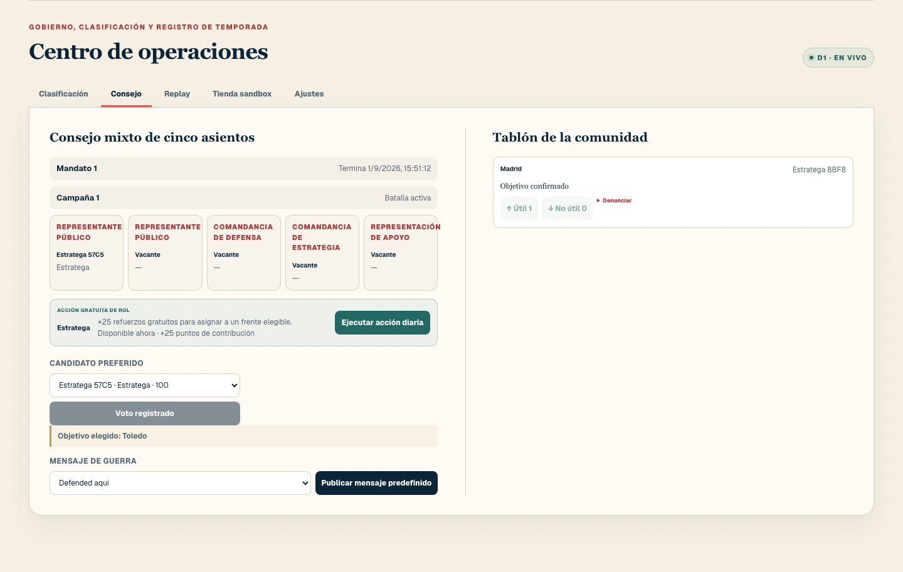
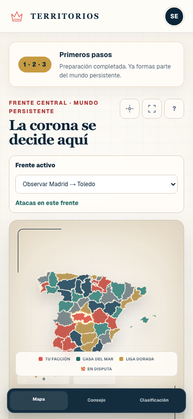

# Territorios

Territorios is a mobile-first, seasonal browser strategy game set across the 52 provinces and autonomous cities of Spain. The game is server-authoritative, deterministic, bilingual (Spanish/English), and built for ChatGPT Sites with platform Auth and D1.

This repository contains the complete `0.1.0` paid-beta candidate:

- official CNIG-derived province geometry with recorded provenance;
- multiple deterministic hourly fronts, council-selected campaign cycles, four daily capture windows, replay hashes, season closure/reset, and leaderboards;
- faction membership, seven daily roles, five-seat councils, announcements, reports, privacy controls, and bounded notifications;
- a Stripe **test-mode only** Checkout integration with verified raw-body webhooks, idempotent grants, proportional refunds, dispute freezes, and user-controlled spending limits;
- a hard combat rule that limits paid power to 20% of a side's effective total power;
- WCAG 2.2 AA automated checks and a 390 px mobile reflow gate.

The legal pages are paid-beta drafts and still require Spanish counsel review before any live-money launch. No live Stripe key is accepted by the application.

## Screenshots

### Live campaign map


### Council and community operations



### Mobile layout



## Run a live local world

Requirements: Node.js `>=22.13` and npm. The full verification suite also needs `sqlite3`.

```bash
git clone https://github.com/detasar/territorios.git
cd territorios
npm ci
npm run dev
```

Open `http://localhost:3000/signin-with-chatgpt?return_to=%2F` to enter through the local ChatGPT Auth simulator. `npm run dev` automatically applies pending migrations to a local D1 database before starting the game, so a fresh clone does not need a separate database command. Generated state persists under the ignored `.wrangler/` directory and the command never migrates the remote D1 database.

Use another port when needed:

```bash
npm run dev -- --port 3020
```

The corresponding sign-in URL is then `http://localhost:3020/signin-with-chatgpt?return_to=%2F`. A healthy world returns `mode: "live-world"` and 52 territories from `http://localhost:3020/api/game`.

The GitHub repository is currently private, so collaborators need repository access before cloning it. Changing source visibility or the owner-only ChatGPT Sites sharing policy is a separate operator decision.

### Optional Stripe sandbox

Create an ignored `.dev.vars` file locally:

```dotenv
STRIPE_SECRET_KEY=sk_test_...
STRIPE_WEBHOOK_SECRET=whsec_...
```

Forward Stripe test events to `/api/payments/webhook`. The server refuses `sk_live_` keys and `livemode: true` events. Checkout success pages only poll D1; they never grant assets. Only a verified webhook may fulfill a purchase.

## Verification

```bash
npm run verify
npm run verify:migration
npm run verify:campaign
npm run verify:runtime
npm run verify:bootstrap
npm run test:e2e
npm audit
```

`npm run verify` runs lint, type checking, coverage thresholds, and the production build. The migration rehearsal creates a disposable SQLite database and checks 29 application tables, 19 triggers, foreign keys, and integrity. The campaign rehearsal uses a separate disposable D1 instance to prove five council-selected conquests, concurrent reconciliation safety, the next planning round, Crown selection, and season reset. The runtime smoke starts the production build against another disposable D1 and checks 52 territories, eight unique fronts, `combat-2.0.0`, public-data boundaries, province metadata, cache controls, and security headers. The bootstrap smoke starts `npm run dev` against an empty disposable D1 and proves that migrations run automatically before a 52-territory world becomes healthy. The Playwright suite likewise creates and removes its own isolated D1; none of these checks opens the project-local `.wrangler` database.

## Final closed-beta release pack

The runnable product, visual, QA, human-testing, deployment, and GO/NO-GO plan for the next release candidate is indexed at:

- [Final closed-beta goal pack](docs/closed-beta-final/README.md)
- [Authoritative master goal](docs/closed-beta-final/MASTER_GOAL.md)
- [Exact 4,000-character Turkish execution goal](docs/closed-beta-final/GOAL_4000_TR.md)
- [Playability and visual audit](docs/closed-beta-final/PLAYABILITY_AND_VISUAL_AUDIT.md)

The pack treats real payment, public access, and live Stripe as out of scope. It requires a backed-up D1 rollout, corrected day-one season start, truthful map-ownership semantics, same-SHA release evidence, and an 8–15-person human gate before broader access.

## Documentation

- [Technical specification](docs/TECHNICAL_SPEC.md)
- [Closed beta usability gate](docs/CLOSED_BETA_TEST_PLAN.md)
- [Final closed-beta release pack](docs/closed-beta-final/README.md)
- [Security policy and threat boundaries](SECURITY.md)
- [Implementation ledger](progress.md)
- [Source-data provenance](data/provenance/provinces.json)

## Release boundary

Version `0.1.0` remains an [owner-only ChatGPT Sites gameplay beta](https://territorios.vecna.chatgpt.site) and a Stripe sandbox integration. The local quick start above runs a complete isolated gameplay world; it does not publish a site or change production data. This server-authenticated D1 application is not a static GitHub Pages build. Campaign-loop improvements are not deployed until the D1 backup/schema rollout is explicitly approved. Territorios is not a live-commerce launch, a financial product, gambling, or a transferable virtual-property system. Support units cannot be traded, cashed out, or transferred between players.
